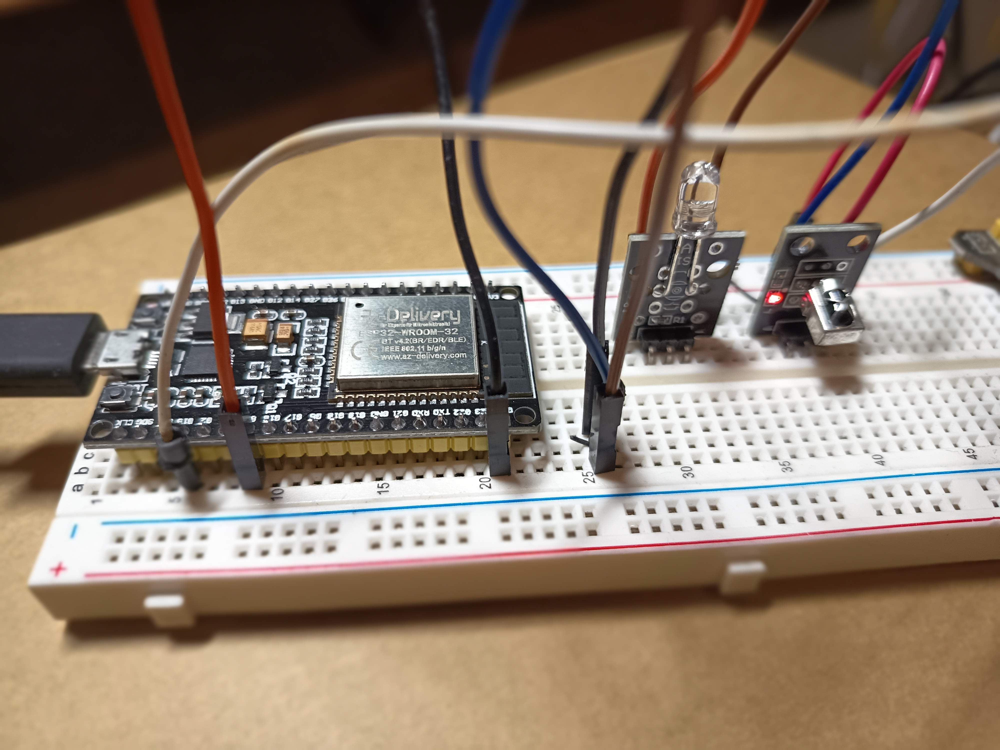
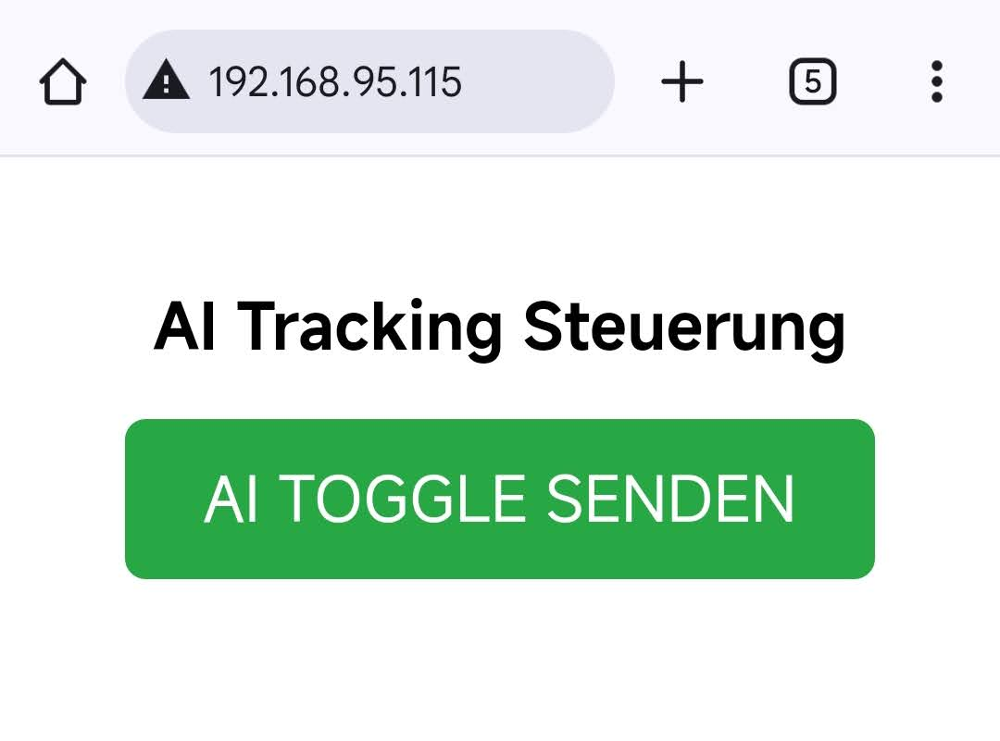

# esp32-webserverToggleAI

Steuerung des AI Trackings einer PTZ-Kamera über WLAN per ESP32.

Mit einem **ESP32-WROOM-32** und einem **KY-005 IR-Sendemodul** kann das **AI Tracking** einer **HDKATOV PTZ-Kamera** durch IR-Signale ein- und ausgeschaltet werden – ganz einfach per Smartphone über WLAN.

> Übrigens: Sollte der Hersteller die AI-Tracking-Funktion doch noch per WebGUI steuerbar machen, wird dieses Projekt als „technische Zwischenlösung mit Lerneffekt“ ganz schnell in Rente geschickt.
---

## 🔧 Funktionsweise

1. **IR-Codes der Fernbedienung auslesen:**  
   → über **KY-022 IR-Empfänger** am ESP32  
2. **AI-Toggle-Code extrahieren (0x6A49, Sony-Protokoll)**  
3. **IR-Sender (KY-005)** mit `sendRaw()` nutzen  
4. **Mini-Webseite auf dem ESP32** mit einem Button zur Fernbedienungssimulation

---
## Versuchsaufbau



## Weboberfläche

Ein einfacher HTML-Button auf der ESP32-Webseite sendet den AI-Toggle-Befehl 5× hintereinander:

<div align="left">
  
</div>


---

## 🧠 Aufbau

| Komponente      | Verbindung                  |
|------------------|-----------------------------|
| ESP32            | Micro-USB an Kamera (5 V)   |
| KY-005 (IR-Modul)| GPIO4 (Signal), GND         |
| WLAN             | SSID: `skitv`, Passwort: `xxxxx` |

---

## 💻 Webserver-Sketch

```cpp
#include <WiFi.h>
#include <WebServer.h>
#include <IRremote.hpp>

#define IR_SEND_PIN 4

const char* ssid = "skitv";
const char* password = "xxxxx";

WebServer server(80);

// AI-Tracking Toggle (IR-Raw-Daten, 0x6A49 Sony)
uint16_t raw_ai_toggle[] = {
  2350,650, 1150,700, 500,650, 550,700,
  1100,700, 500,750, 450,700, 1150,650,
  550,700, 500,700, 1150,650, 550,650,
  1150,650, 550,650, 1150,700, 1100
};

void handleRoot() {
  String html = R"rawliteral(
    <!DOCTYPE html><html><head>
    <meta name="viewport" content="width=device-width, initial-scale=1">
    <title>ESP32 AI Tracking</title>
    <style>
      body { font-family: sans-serif; text-align: center; margin-top: 50px; }
      button {
        font-size: 1.5rem; padding: 15px 30px;
        background-color: #28a745; color: white; border: none;
        border-radius: 8px; cursor: pointer;
      }
    </style>
    </head><body>
      <h2>AI Tracking Steuerung</h2>
      <form action="/toggle" method="POST">
        <button>AI TOGGLE SENDEN</button>
      </form>
    </body></html>
  )rawliteral";

  server.send(200, "text/html", html);
}

void handleToggle() {
  Serial.println("🟣 Web: Sende AI Toggle (5×)");
  for (int i = 0; i < 5; i++) {
    IrSender.sendRaw(raw_ai_toggle, sizeof(raw_ai_toggle) / sizeof(raw_ai_toggle[0]), 38);
    delay(100);
  }
  server.sendHeader("Location", "/");
  server.send(303); // redirect
}

void setup() {
  Serial.begin(115200);
  delay(200);

  IrSender.begin(IR_SEND_PIN, ENABLE_LED_FEEDBACK, USE_DEFAULT_FEEDBACK_LED_PIN);
  WiFi.begin(ssid, password);

  Serial.print("🔌 Verbinde mit WLAN "); Serial.println(ssid);
  while (WiFi.status() != WL_CONNECTED) {
    delay(500); Serial.print(".");
  }
  Serial.println(); Serial.print("✅ Verbunden! IP-Adresse: ");
  Serial.println(WiFi.localIP());

  server.on("/", handleRoot);
  server.on("/toggle", HTTP_POST, handleToggle);
  server.begin();
  Serial.println("🌍 Webserver gestartet");
}

void loop() {
  server.handleClient();
}
```

## Beispielausgabe im Serial Monitor
```
✅ Verbunden! IP-Adresse: 192.168.95.115
🌍 Webserver gestartet
🟣 Web: Sende AI Toggle (5×)
🟣 Web: Sende AI Toggle (5×)
```
## 📦 Projektstatus
✅ Der Infrot-Sender funktioniert in bis zu 1 m Entfernung zur Kamera  
✅ Die Stromversorgung des ESP32 und des IR-Senders funktioniert per USB direkt aus der HDKATOV PTZ-Kamera  
✅ AI Tracking lässt sich zuverlässig per WLAN schalten  
📱 Webseite ist mobilfreundlich und sofort verfügbar  
🛠️ Geplant ist noch ein kleines Gehäuse mit passender Platine – dann wird aus dem Prototyp ein richtiges Mini-Modul zum Ankleben an die Kamera.  
## Oder..
🤷‍♂️ Oder der chinesische Hersteller implementiert die Funktion doch noch in die WebGUI – dann ist mein Projekt zwar hinfällig, aber das wäre auch völlig in Ordnung. 😉
